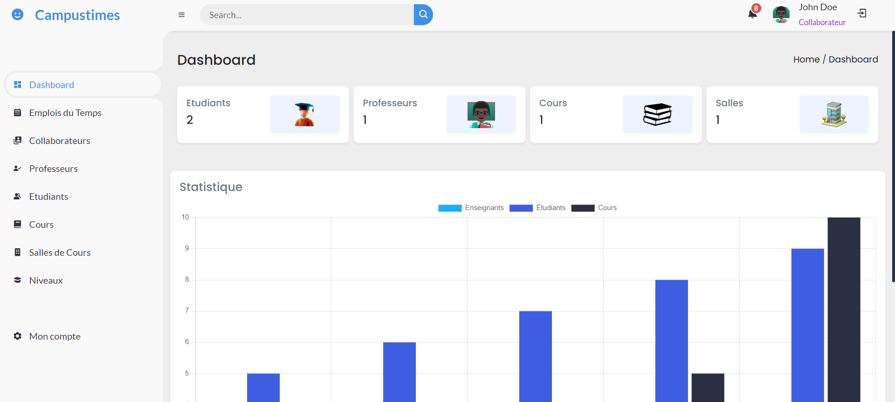
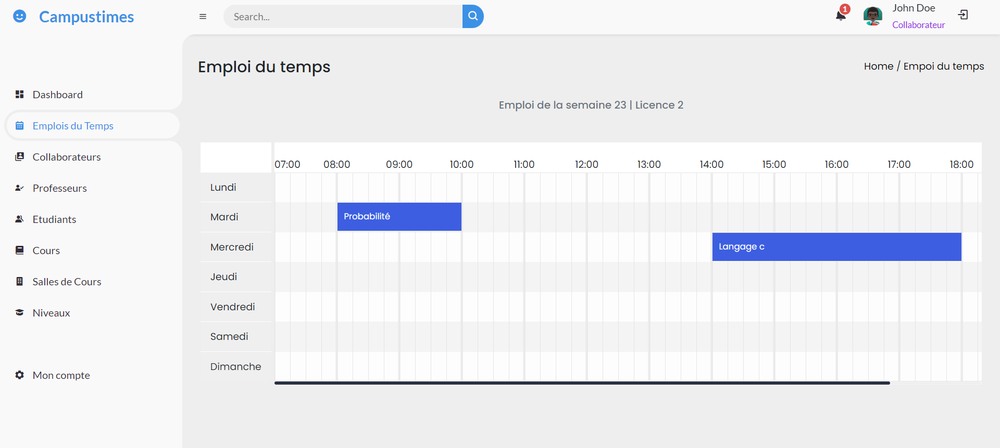

## CAMPUSTIMES 

## Description

Le projet campustimes est un projet qui consiste à déployer une application capable de gérer la planification des emplois du temps.

## Preview

### - Authentification


### - Inscription


### Dashboard (Admin)



### Dashboard (Étudiant)


### Dashboard (Professeur)


### Liste des emplois du temps (Admin)


### Visualisation d'un emploi du temps



## DEMO

Vous pouvez tester le démo de l'application sur la version en ligne avec ce compte administrateur :

- Email : johndoe@example.com
- Mot de passe : admin007

## Installation

Pour récupérer et lancer l'application sur votre machine, assurez-vous d'abord d'avoir PHP et Composer installés. Ensuite, procédez aux étapes suivantes :

```bash
git clone https://github.com/Abdoulrachard/Campustimes-laravel.git
```
```bash
cd campustimes-laravel
```

```bash	
composer install
```
```bash 
cp .env.example .env 
```
```bash	
php artisan key:generate
```
```bash	
php artisan migrate
```

```bash	
php artisan serve
```
L'application va démarrer sur l'adresse http://localhost:8000 :  copiez cette adresse et ouvrez-la dans le navigateur.
L'application est maintenant lancée !

Si vous avez besoin d'aide, contactez-moi directement à [abdoulrachard@gmail.com](mailto:abdoulrachard@gmail.com).


